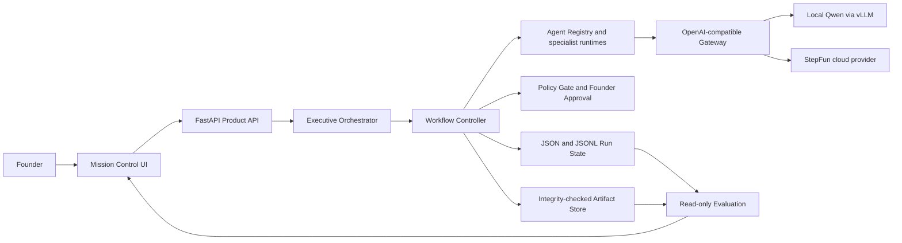

# Co-founder OS — Founder Mission Control

> An AI operating system for solo founders that turns goals and evidence into auditable workflows, coordinating product, engineering, finance, and risk agents with human approval.

Co-founder OS is an OpenAI Build Week project for turning a founder objective into a bounded, inspectable execution process. It combines structured planning, specialist agents, deterministic governance, durable artifacts, human approval, and replayable state in one local-first web application.

The project is deliberately more than a multi-agent chat. Tasks have explicit owners and dependencies; execution is claimed atomically; retries are bounded; artifacts are integrity-checked; high-risk actions stop at a policy gate; and every material transition is recorded for later inspection.

The repository also includes a fully synthetic traffic-accident insurance POC. It demonstrates the complete governed workflow without representing the output as legal advice, an autonomous liability decision, or a production insurance integration.

## Core value

Most AI tools return an answer. Co-founder OS returns a controlled operating trail:

- **From objective to execution:** an Executive Orchestrator converts a founder goal into a dependency-aware task plan.
- **From roles to contracts:** registered Product, Finance, Engineering, Risk, and synthesis roles produce structured, versioned outputs instead of free-form group chat.
- **From generation to evidence:** deliverables are stored with lineage, checksums, provenance, and source evidence.
- **From autonomy to accountable control:** deterministic policy rules stop guarded actions until the founder approves or rejects them.
- **From demo to inspectable system:** Mission Control shows tasks, routes, artifacts, approvals, and audit events; the Evaluation workspace scores persisted evidence without making another model call.

## What is implemented

### Founder workflow runtime

- Strict Pydantic models for Runs, Tasks, Artifacts, Approvals, routing decisions, and audit events.
- Explicit Agent Registry with capability matching and fail-closed assignment.
- Task lifecycle state machine with dependency-aware readiness.
- Atomic task claiming, claim tokens, competing-claim rejection, and idempotent re-claiming.
- Bounded retries, terminal failures, restart recovery, and completed-run replay.
- A single Workflow Controller as the authority for task and Run transitions.

### Agents and deliverables

- Executive planning and orchestration through the internal Gateway boundary.
- Product and Finance agents with strict structured-output validation and one bounded repair attempt.
- Artifact synthesis into an executive decision memo, PRD, budget summary, risk register, and action plan.
- Insurance POC specialist execution in which Engineering Planning and Risk Review can use a healthy live provider; other POC stages are explicitly labeled deterministic controls or local fallbacks.

### Model gateway and routing

- One OpenAI-compatible `POST /v1/chat/completions` boundary.
- Three stable virtual model names: `cofounder-auto`, `cofounder-qwen`, and `cofounder-step`.
- Qwen through an OpenAI-compatible endpoint, typically local vLLM on NVIDIA DGX Spark.
- StepFun as the optional cloud provider.
- Provider fallback, measured health, routing rationale, request IDs, token usage, latency, and privacy-aware routing evidence.
- A D15 insurance router with hard eligibility filters and transparent scoring. It is deterministic and is **not** presented as a learned router.

### Governance, persistence, and evaluation

- Deterministic Policy Gate for external writes, production changes, irreversible actions, material budget decisions, and unrecognized command execution.
- Founder approval, rejection, pause, and resume with persisted policy evidence.
- File-based Run state using structured JSON and append-only JSONL events.
- Atomic, run-isolated Artifact Store with SHA-256 verification, path-safety checks, and idempotent writes.
- Same-origin Founder Mission Control UI with no separate frontend runtime.
- Read-only Evaluation workspace covering workflow outcome, execution reliability, artifact evidence, governance, and auditability.

### Synthetic insurance POC

The primary demo turns one synthetic requirements PDF, two synthetic accident images, budget and project facts, and a founder mission into a governed two-week POC delivery package.

The checked-in path includes:

- checksum-verified fixtures and bounded evidence extraction;
- source-linked evidence with modality, confidence, privacy level, and Agent usage;
- a fixed ten-task DAG and ten persisted routing decisions;
- parallel Product/Finance and Engineering/Risk work;
- explicit scope-budget and decision-authority conflict resolution;
- six final deliverables plus verification and conflict records;
- a denied private-data upload path and a founder-approved sanitized release path;
- deterministic fallback when no eligible live provider is healthy.

The two PNG findings use a SHA-256-bound synthetic fixture adapter. Arbitrary image understanding is not implemented and unsupported images fail recoverably.

## System architecture



The deployment contract is local-first:

```text
Mac browser or application
    -> optional SSH tunnel at 127.0.0.1:19000
    -> FastAPI Gateway/Product runtime at 127.0.0.1:9000 on DGX Spark
         -> local Qwen/vLLM at 127.0.0.1:8000
         -> optional StepFun cloud endpoint
```

Application code calls the Gateway; it does not call Qwen or StepFun directly. The Gateway owns provider access and routing metadata. The Product API owns Runs, Tasks, Approvals, Artifacts, and workflow recovery. Only the Workflow Controller changes authoritative workflow state.

See [the architecture contract](docs/architecture-contract.md), [domain model](docs/domain-model.md), and [workflow controller](docs/workflow-controller.md) for the detailed boundaries.

## End-to-end workflow

1. The founder enters an objective and optional context in Mission Control.
2. The Executive Orchestrator requests a bounded plan and validates the Agent assignments and dependency graph.
3. The orchestration service persists the Run, Tasks, route decisions, and append-only events.
4. The Workflow Controller finds ready tasks and obtains an atomic claim for the registered executor.
5. The Agent or deterministic task adapter reads persisted inputs and produces a strict, versioned result.
6. The Artifact Store writes output atomically, verifies its checksum, and registers lineage and provenance.
7. Failures receive at most the allowed number of retries; exhausted work reaches an explicit terminal state instead of being reported as success.
8. The synthesizer resolves Product and Finance evidence into a decision package.
9. The Policy Gate evaluates guarded actions. A required approval moves the Run to `waiting_approval`.
10. The founder approves or rejects the pending action. Approval resumes the same persisted Run.
11. Mission Control exposes the resulting artifacts and audit trace; Evaluation scores the persisted evidence without mutating the workflow.

The insurance POC follows the same authorities while adding multimodal fixture evidence, adaptive explainable routes, two live-capable specialist tasks, deterministic verification, and a capability-bound approval cookie.

## Technology stack

| Layer | Technology |
| --- | --- |
| Backend and API | Python 3.10+, FastAPI, Uvicorn |
| Contracts and configuration | Pydantic 2, pydantic-settings |
| Provider access | httpx, OpenAI-compatible Chat Completions interface |
| Reliability | Tenacity plus explicit state, claim, retry, and recovery services |
| Persistence | Structured JSON, append-only JSONL, filesystem Artifact Store, SHA-256 |
| Document and fixture handling | pypdf; Pillow and ReportLab for development fixture tooling |
| Frontend | HTML, CSS, vanilla JavaScript served by FastAPI |
| Local inference target | Qwen through vLLM on NVIDIA DGX Spark |
| Optional cloud provider | StepFun |
| Quality gates | pytest, pytest-asyncio, Ruff, Mypy, Node syntax check, Python build |
| Build Week development | OpenAI Codex and GPT-5.6 |

## What was built during OpenAI Build Week

The product concept and earlier hackathon planning predated this implementation sprint. The repository itself contains no pre-Build-Week implementation history: its first commit is dated July 15, after the July 13 Build Week opening. The code claims below are therefore tied to the repository's dated commits rather than to prior concept work.

During Build Week, the repository progressed through these delivered stages:

| Stage | Delivered work |
| --- | --- |
| Gateway foundation | FastAPI gateway, Qwen/Step provider registry, virtual models, fallback, health, and privacy-safe request audit |
| D00-D05 | Frozen local/DGX architecture, deployment workflow, domain models, file state repository, orchestration service, and Executive Orchestrator |
| D06-D10 | Agent execution contract, atomic Artifact Store, Product and Finance agents, lifecycle integration, Policy Gate, Artifact Synthesizer, Workflow Controller, retries, and recovery |
| D11-D13 | Stable Product API, Founder Mission Control UI, and deterministic read-only Evaluation dashboard |
| D14 | Synthetic insurance fixtures, Evidence Package, explainable routing, governed golden workflow, verification, and reproducible demo evaluation |
| D15 | Gateway-backed Engineering Planning and Risk Review, bounded structured-output repair, adaptive provider scoring, verified call metadata, and truthful local fallback |

The detailed acceptance history is recorded in [PROJECT_STATE.md](docs/project-control/PROJECT_STATE.md), the stage contracts under [`tasks/`](tasks/), and the Git commit history.

## How Codex was used

[OpenAI Codex](https://developers.openai.com/codex/) was the engineering execution partner for the Build Week implementation. Its use was concrete and repository-centered:

- **Repository understanding:** traced request, state, artifact, approval, and recovery paths before changing a stage.
- **Milestone decomposition:** converted architecture goals into D00-D15 tasks with explicit scope, non-goals, acceptance criteria, and exit checks.
- **Implementation:** drafted and revised Python services, strict Pydantic contracts, FastAPI routes, frontend behavior, fixture tooling, and documentation.
- **Test construction:** added behavioral tests for lifecycle transitions, wrong or competing claim tokens, artifact corruption, idempotent retries, partial writes, restart recovery, policy decisions, routing evidence, and fallback truthfulness.
- **Debugging:** inspected failing tests and runtime evidence, then made narrow corrective changes such as output-budget fixes, long-running job polling, and live-call accounting hardening.
- **Review and release discipline:** inspected diffs, ran the full verification matrix, checked for secret and path leakage, and kept feature, corrective, and acceptance commits separate.

The Git history intentionally preserves corrective work instead of presenting a one-shot generation story. Examples include rejected or superseded execution foundations, artifact-integrity fixes, lifecycle recovery corrections, independent-review follow-ups, and D14/D15 truthfulness hardening.

## How GPT-5.6 was used

GPT-5.6 was used during development for higher-level reasoning and review, not as a runtime provider inside Co-founder OS. The runtime code in this repository routes to Qwen and StepFun; it does **not** call GPT-5.6.

GPT-5.6 supported the human developer in areas where cross-cutting judgment mattered most:

- defining authority boundaries among the Executive Orchestrator, specialist Agents, Workflow Controller, Policy Gate, and founder;
- stress-testing task-claim, idempotency, retry, approval, terminal-failure, and replay semantics;
- identifying hidden loops, ambiguous ownership, false-success paths, and ways model output could bypass deterministic control;
- reviewing privacy, capability, health, cost, and fallback factors in the explainable routing policy;
- designing representative founder-task and insurance-POC evaluation scenarios;
- reconciling Product, Finance, Engineering, and Risk outputs into a coherent product experience;
- improving Mission Control information hierarchy and the clarity of live-model, fallback, and deterministic-control labels.

The practical lesson was that stronger reasoning was most valuable at system boundaries: deciding what an Agent may do, what evidence must be persisted, which failures are recoverable, and when the workflow must stop for a human.

## Human decisions and review

Codex and GPT-5.6 accelerated the work, but they were not given final authority over the product or repository. The founder retained responsibility for:

- choosing the product problem, synthetic insurance scenario, and success criteria;
- freezing the Mac/DGX/Gateway deployment boundary and supported providers;
- deciding which roles may use a model and which controls must remain deterministic;
- setting the privacy, budget, external-write, and human-approval rules;
- accepting, rejecting, or correcting implementation stages;
- reviewing generated code, tests, documentation, diffs, and release evidence;
- making the final publication and submission decisions.

AI-generated proposals were treated as drafts. Acceptance required automated checks plus human review of behavior, claims, security boundaries, and demo truthfulness. The product mirrors this development model: Agents can advance bounded work, but policy and high-impact decisions remain under explicit human control.

## Installation

### Requirements

- Python 3.10 or newer
- Node.js only for the optional frontend syntax check
- Optional: an OpenAI-compatible Qwen endpoint and/or StepFun credentials
- Optional deployment target: NVIDIA DGX Spark with Qwen served through vLLM

### Create the environment

```bash
git clone https://github.com/JimchengChina/cofounder-os.git
cd cofounder-os
python3 -m venv .venv
source .venv/bin/activate
python -m pip install --upgrade pip setuptools wheel
python -m pip install -e ".[dev]"
```

### Provider configuration

The stable insurance demo can run through declared deterministic fallbacks without a live model provider. For live Gateway execution, copy the template and replace only the values for providers you actually use:

```bash
cp .env.example .env
```

Important variables:

| Variable | Purpose | Default |
| --- | --- | --- |
| `QWEN_BASE_URL` | OpenAI-compatible Qwen endpoint | `http://127.0.0.1:8000/v1` |
| `QWEN_API_KEY` | Qwen endpoint credential | unset in application settings |
| `QWEN_MODEL` | Served Qwen model ID | placeholder |
| `STEP_BASE_URL` | StepFun API base | `https://api.stepfun.com/step_plan/v1` |
| `STEP_API_KEY` | StepFun credential | unset |
| `STEP_MODEL` | StepFun model ID | `step-3.7-flash` |
| `GATEWAY_HOST` / `GATEWAY_PORT` | Runtime bind address and port | `127.0.0.1` / `9000` |
| `PRODUCT_DATA_DIR` | Run state and Artifact Store root | `data` |
| `AUDIT_DIR` | Gateway request-audit directory | `data/audit` |
| `GATEWAY_AUDIT_TOKEN` | Optional token for `GET /audit/recent` | unset |

Never commit a real `.env` file or provider credential.

## Run the application

```bash
source .venv/bin/activate
bash scripts/run_gateway.sh
```

Open:

- Mission Control: <http://127.0.0.1:9000/ui>
- OpenAPI documentation: <http://127.0.0.1:9000/docs>
- Gateway health: <http://127.0.0.1:9000/health>
- Product API health: <http://127.0.0.1:9000/api/health>

A generic founder mission uses the Gateway and therefore needs at least one working provider. The stable insurance POC has a disclosed deterministic fallback path.

## Reproduce the insurance demo

Verify the checked-in fixtures, then start an isolated runtime:

```bash
source .venv/bin/activate
python scripts/build_insurance_poc_fixtures.py --verify-only
PRODUCT_DATA_DIR=/tmp/cofounder-os-insurance-demo/data \
GATEWAY_PORT=9100 \
bash scripts/run_gateway.sh
```

Open <http://127.0.0.1:9100/ui>, select **Load stable demo**, and launch the mission. The expected bounded stop is `waiting_approval`; approve or reject the guarded release in the Approval workspace to complete the run.

For the complete scenario, evidence contract, fallback rules, and demo narration, see [docs/insurance-poc-demo.md](docs/insurance-poc-demo.md).

## API surface

| Endpoint | Purpose |
| --- | --- |
| `GET /health` | Provider-aware Gateway health |
| `GET /v1/models` | Stable virtual model list |
| `POST /v1/chat/completions` | Unified non-streaming provider request |
| `GET /audit/recent` | Bounded Gateway request audit |
| `POST /api/runs` | Create and drive a generic founder workflow |
| `GET /api/runs/{run_id}` | Retrieve Run, Task, route, approval, artifact, and event state |
| `GET /api/runs/{run_id}/artifacts` | Retrieve verified artifact metadata and bounded text content |
| `POST /api/runs/{run_id}/approvals/{approval_id}` | Resolve one approval and resume |
| `POST /api/runs/{run_id}/retry` | Retry, recover, or replay through the Workflow Controller |
| `GET /api/evaluation/summary` | Read-only cross-Run evaluation |
| `GET /api/evaluation/runs/{run_id}` | Read-only evaluation of one Run |
| `/api/insurance-poc/*` | Fixture, evidence, routing, workflow-job, and demo-evaluation endpoints |

## Testing and verification

Run the same repository-level checks used for release verification:

```bash
source .venv/bin/activate
ruff check app tests scripts/run_insurance_poc_evaluation.py
mypy app
pytest -q
node --check app/ui/static/app.js
python -m build --no-isolation
git diff --check
```

The current repository passes 456 tests, Ruff, strict Mypy across 66 source files, frontend JavaScript syntax checking, package build, and whitespace validation. The suite may emit Pydantic and Starlette deprecation warnings; they do not currently fail the checks.

To run the committed small-sample insurance demo evaluation:

```bash
python scripts/run_insurance_poc_evaluation.py \
  --data-dir /tmp/cofounder-os-insurance-evaluation \
  --output examples/insurance-poc/demo-evaluation-results.json
```

This is a six-sample demo acceptance measurement, not statistical model-quality evidence. When no approved live baseline is configured, the output marks that baseline unavailable and claims no comparative delta.

## Project structure

```text
app/
├── agents/              # Agent Registry and Product/Finance contracts
├── api/                 # Gateway, Product, Evaluation, and insurance POC routes
├── artifacts/           # Atomic filesystem Artifact Store
├── audit/               # Privacy-safe Gateway request audit
├── clients/             # Internal Gateway client
├── domain/              # Strict Run/Task/Artifact/Approval data models
├── evaluation/          # Deterministic read-only scoring
├── insurance_poc/       # Fixtures, evidence, routing, live Agents, and workflow
├── orchestrators/       # Executive planning and materialization
├── policy/              # Deterministic Policy Gate
├── providers/           # OpenAI-compatible Qwen and Step adapters
├── router/              # Virtual-model selection and fallback
├── services/            # Execution, lifecycle, orchestration, and controller
├── state/               # Lifecycle machine and file repository
├── synthesizers/        # Cross-Agent deliverable synthesis
└── ui/                  # Same-origin Mission Control frontend
docs/                    # Architecture, API, demo, evaluation, and governance docs
examples/                # Synthetic demo assets and reproducible evaluation data
scripts/                 # Startup, fixture, smoke, deployment, and verification tools
tasks/                   # D06-D15 stage scope and acceptance contracts
tests/                   # Behavioral and regression test suite
```

## Known limitations

- The application is a hackathon prototype, not a production multi-tenant service.
- State and artifacts are filesystem-backed and designed for a single process and single worker.
- Provider registration happens at startup; changing providers requires a restart.
- Generic chat completions and product endpoints do not yet have full request-level authentication.
- Gateway audit files rotate only by UTC day and have no size-based retention policy.
- Health checks synchronously call each configured provider's model endpoint.
- Only the insurance Engineering Planning and Risk Review tasks have D15 live-model execution; other insurance stages are deterministic controls or local fallbacks.
- Arbitrary image analysis is not implemented; the demo recognizes only checksum-bound synthetic image fixtures.
- The adaptive insurance router is rule- and score-based, not trained.
- The Engineering artifact is a plan. It does not claim a code diff, executed tests, or deployment.
- No real insurer write, email, payment, production change, or autonomous liability decision occurs.
- The committed six-case demo evaluation is too small to establish general model quality.

## Roadmap

- Replace the checksum-bound image adapter with general, evaluated multimodal evidence ingestion.
- Add live, strictly governed specialist execution for more roles while preserving deterministic policy authority.
- Expand founder roles into Growth, Operations, Legal, and HR.
- Add durable database/queue infrastructure, multi-worker coordination, authentication, and retention controls.
- Build statistically meaningful quality, cost, latency, fallback, and human-intervention evaluations.
- Add secure tool and MCP integrations behind explicit scopes and approval gates.
- Support long-running missions, recurring reviews, and cross-project organizational memory.

## License and disclaimer

The package metadata in `pyproject.toml` declares the project as **MIT**. A standalone `LICENSE` file is not currently included in the repository; add one before treating the repository as a complete license distribution.

Co-founder OS is experimental software. The insurance scenario, documents, images, companies, vehicles, and claim facts are synthetic. Outputs are demonstrations of workflow orchestration and are not legal, financial, insurance, compliance, or professional advice. Do not use the prototype to make real liability, coverage, payment, production, or other high-impact decisions without qualified human review and appropriate security controls.

---

Built by a solo founder during OpenAI Build Week with Codex and GPT-5.6 as development partners—and with final product, architecture, safety, and release decisions retained by the human builder.
